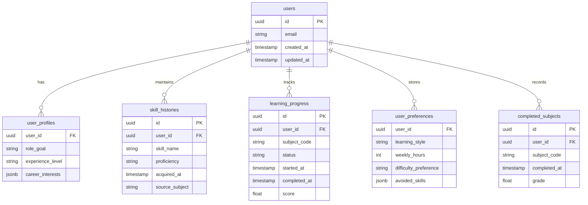
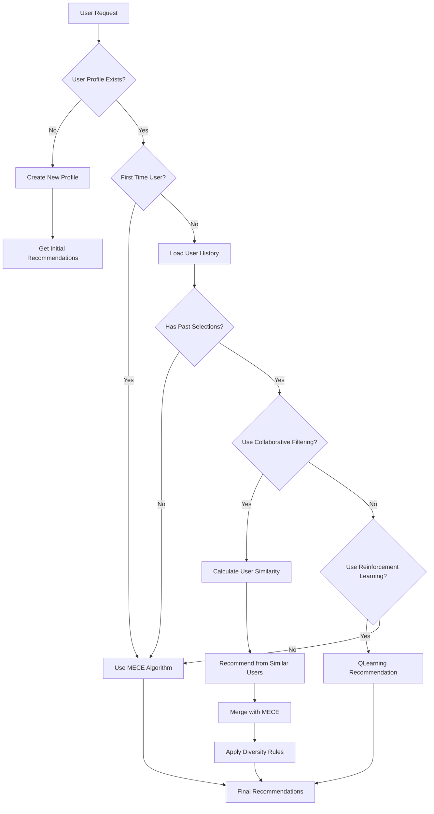

# Personalized Learning Paths - Architecture Plan

## Overview

Add persistent user profiles with Supabase to enable personalized learning paths, progress tracking, and adaptive recommendations.

## Status: IMPLEMENTED ✅

All core features have been implemented. See the implementation summary below.

---

## Core Features

### 1. User Profiles (Database Schema) ✅



### 2. API Endpoints ✅

| Endpoint                                | Method | Description                      |
| --------------------------------------- | ------ | -------------------------------- |
| `/api/v1/users/profile`                 | POST   | Create user profile              |
| `/api/v1/users/profile`                 | GET    | Get user profile                 |
| `/api/v1/users/profile`                 | PUT    | Update user profile              |
| `/api/v1/users/skills`                  | GET    | Get user's skill history         |
| `/api/v1/users/skills`                  | POST   | Add skills to history            |
| `/api/v1/users/skills/{skill_id}`       | DELETE | Remove skill from history        |
| `/api/v1/users/preferences`             | GET    | Get user preferences             |
| `/api/v1/users/preferences`             | PUT    | Update user preferences          |
| `/api/v1/users/progress`                | GET    | Get learning progress            |
| `/api/v1/users/progress`                | POST   | Create progress entry            |
| `/api/v1/users/progress/{id}`           | PUT    | Update progress entry            |
| `/api/v1/users/subjects/complete`       | POST   | Mark subject complete            |
| `/api/v1/users/subjects/completed`      | GET    | Get completed subjects           |
| `/api/v1/users/skill-coverage`          | GET    | Get skill coverage analysis      |
| `/api/v1/users/progress-summary`        | GET    | Get progress summary             |
| `/api/v1/users/feedback`                | POST   | Record recommendation feedback   |
| `/api/v1/recommendations/adaptive`      | POST   | Get personalized recommendations |
| `/api/v1/recommendations/similar-users` | GET    | Get similar users                |

### 3. Adaptive Recommendation Engine ✅



---

## Implementation Summary

### Files Created

| File                               | Description                                                      | Status      |
| ---------------------------------- | ---------------------------------------------------------------- | ----------- |
| `app/models/user.py`               | Pydantic models for user profiles, skills, preferences, progress | ✅ Complete |
| `app/utils/supabase_client.py`     | Supabase client configuration                                    | ✅ Complete |
| `app/services/user_service.py`     | User CRUD operations                                             | ✅ Complete |
| `app/services/progress_service.py` | Progress tracking logic                                          | ✅ Complete |
| `app/services/adaptive_service.py` | Collaborative filtering + Q-learning                             | ✅ Complete |
| `app/routers/user.py`              | User API endpoints                                               | ✅ Complete |
| `app/routers/progress.py`          | Progress API endpoints                                           | ✅ Complete |
| `app/routers/adaptive.py`          | Adaptive recommendation endpoints                                | ✅ Complete |
| `plans/supabase_schema.sql`        | Database schema with RLS policies                                | ✅ Complete |
| `.env.example`                     | Environment configuration template                               | ✅ Complete |

### Implementation Steps Completed

#### Phase 1: Database & Configuration ✅

- [x] Set up Supabase project (credentials provided)
- [x] Add supabase client to requirements.txt
- [x] Create database tables
- [x] Configure Row Level Security (RLS)

#### Phase 2: User Profile Module ✅

- [x] Create `app/models/user.py` - User profile models
- [x] Create `app/services/user_service.py` - User CRUD operations
- [x] Create `app/routers/user.py` - User endpoints
- [ ] Add authentication endpoints - DEFERRED (requires more work)

#### Phase 3: Progress Tracking ✅

- [x] Create `app/services/progress_service.py` - Progress tracking logic
- [x] Create `app/routers/progress.py` - Progress endpoints
- [x] Add skill coverage calculation

#### Phase 4: Adaptive Recommendations ✅

- [x] Create `app/services/adaptive_service.py` - Adaptive algorithm
- [x] Implement collaborative filtering
- [x] Implement Q-learning for reinforcement learning
- [x] Create `/recommendations/adaptive` endpoint

---

## Dependencies (requirements.txt)

```python
fastapi>=0.115.0
uvicorn>=0.32.0
pydantic>=2.10.0
genai>=0.7.0
supabase>=2.0.0
python-multipart>=0.0.6
```

---

## Environment Variables

```bash
# .env file
SUPABASE_URL=https://mdaedtamxtuemypxrotm.supabase.co
SUPABASE_KEY=sb_publishable_p_DVufIicAtwtAM2s85kpw_GKspr3e2
# Optional: Google Gemini API (for LLM features)
# GOOGLE_API_KEY=your_google_api_key
```

---

## Progress Visualization Data ✅

Return format for progress tracking:

```json
{
  "user_id": "uuid",
  "overall_progress": 45.5,
  "completed_subjects": 5,
  "total_subjects": 12,
  "skill_coverage": {
    "covered": ["python", "sql"],
    "in_progress": ["data_visualization"],
    "missing": ["machine_learning"]
  },
  "career_path": "data_analyst",
  "next_milestone": "Complete Database Systems",
  "estimated_completion": "2026-06-15"
}
```

---

## Pending / Future Work

1. **Authentication Endpoints** - Full JWT authentication not yet implemented
2. **Rate Limiting** - Apply rate limits to prevent abuse
3. **Caching** - Cache user profiles in memory for fast access
4. **Migration** - Support importing existing JSON data to Supabase
5. **Offline Support** - Consider local storage for offline progress tracking

---

## Next Steps to Run

1. **Run the SQL schema** - Copy `plans/supabase_schema.sql` and run in Supabase SQL Editor
2. **Set environment variables** - Copy `.env.example` to `.env` with your Supabase credentials
3. **Install dependencies** - `pip install -r requirements.txt`
4. **Start server** - `uvicorn app.main:app --reload`
